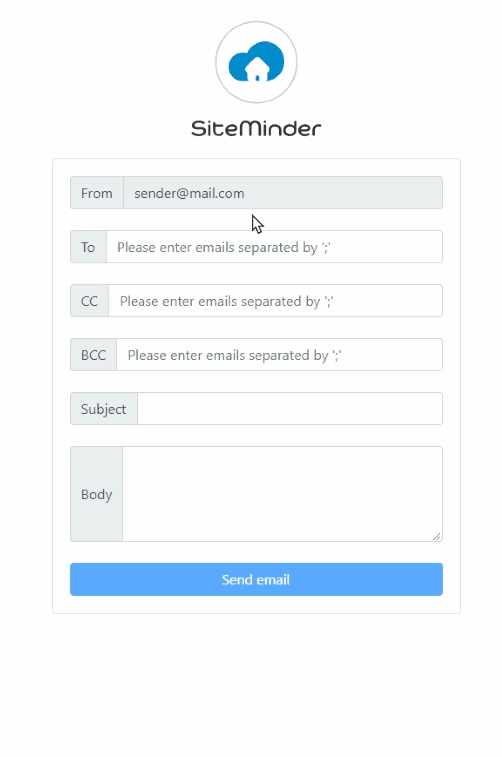

# SM Angular Email

This project allows user to send, cc and bcc emails to multiple recipients via an online form.

# Screen recording

## Development server

Run `ng serve` for a dev server. Navigate to `http://localhost:4200/`. The app will automatically reload if you change any of the source files.

## Instructions

* Enter an email and press `;` or `Enter Key` to save an email into multiple email pills
* To see the validation messages, you have to BLUR on the input filed. This pattern is for hiding annoying error messages when user type email address.
* After saving an email address, this email address will be available in the auto-suggestion list
* Validation rules
  * Recipient email cannot be empty
  * All Email fields must comply with [W3C input email spec](https://www.w3.org/TR/2012/WD-html-markup-20120320/input.email.html)
* Server response is mocked and always successful

## Technical implementation

* Email module is an individual module with module route
* Email module has no external service or component dependencies
* Form is implemented based on [Angular reactive form](https://angular.io/guide/reactive-forms)
* Multiple email control is implemented based on[Angular ControlValueAccessor](https://angular.io/api/forms/ControlValueAccessor)
* Multiple emails Validation is piped through reactive form custom validator
* Typeahead directive is from [ng-bootstrap](https://ng-bootstrap.github.io/#/components/typeahead/examples)

## Potential improvement

* Centralized notification service
* Global interceptor that handles error messages
* Full screen masked loader
* More clear form layout probably depends on focus group feedback

## Notes
This repo only contains a front end as agreed. Initially, I was implementing this with Vue and Node until I got more clarity from Stefano. After realising that using an unfamiliar framework may affect my chance to pass this test, 3 days ago I decided to switch to angular to fully show my technical skills. Here is the previous incomplete [Vue & Node stack](https://github.com/zac1st1k/vue-email-demo) just for reference.
